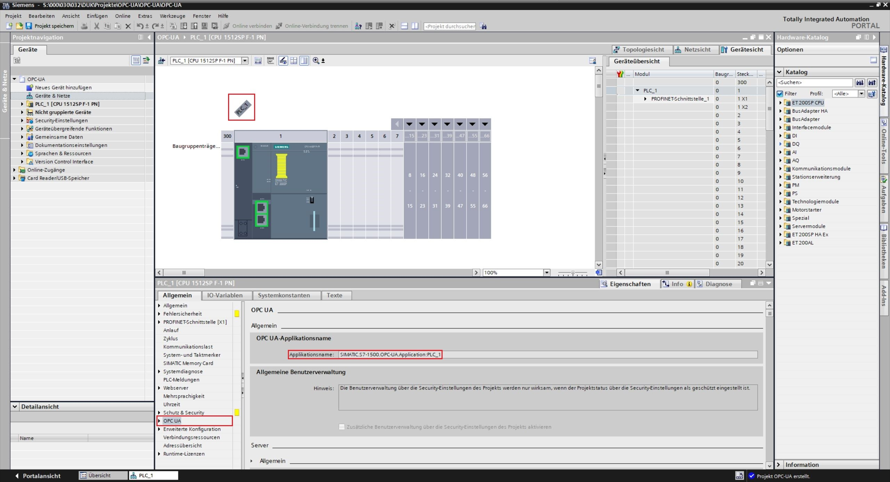
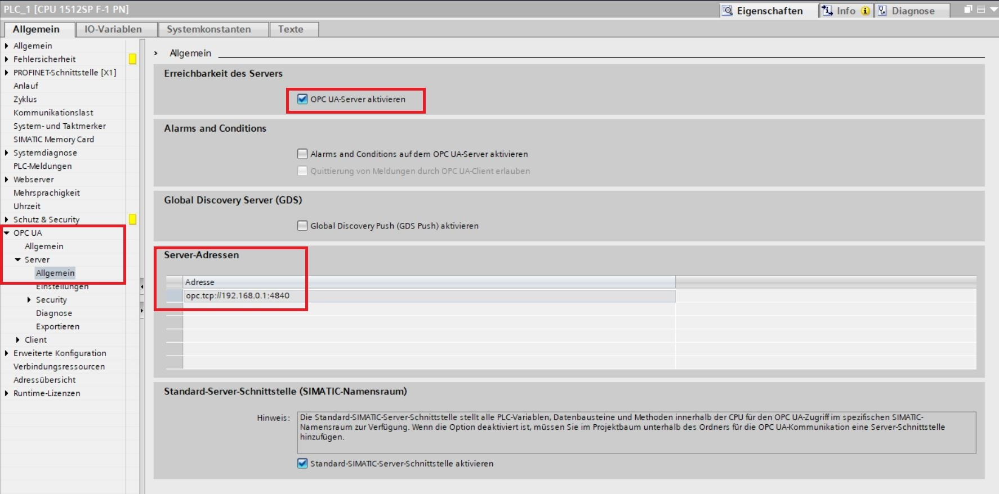
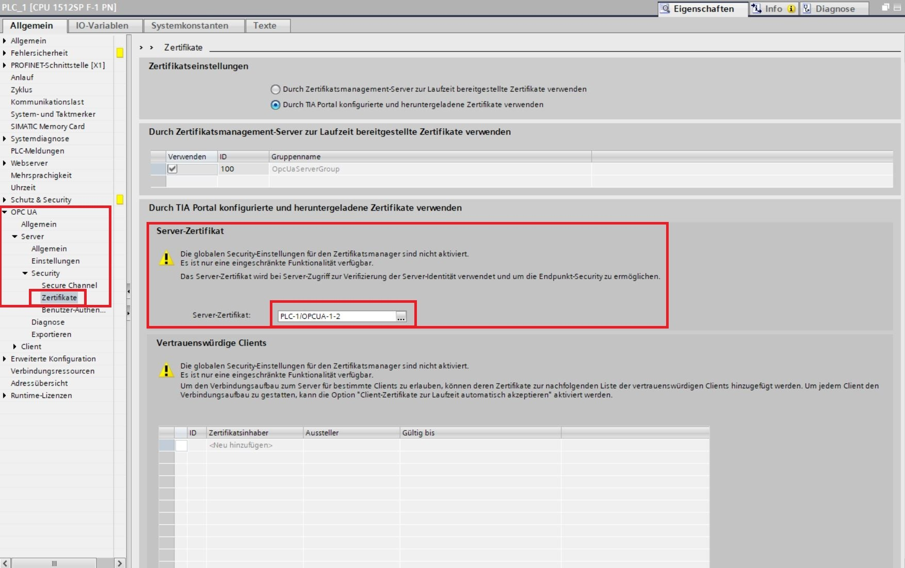
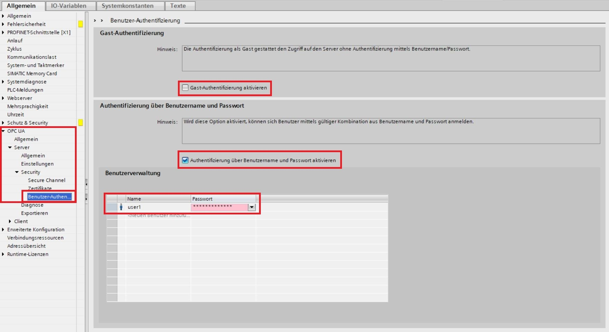
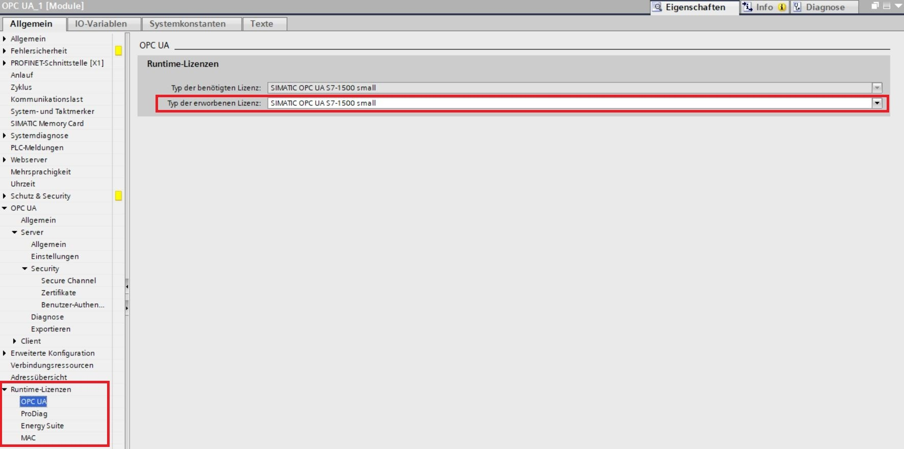
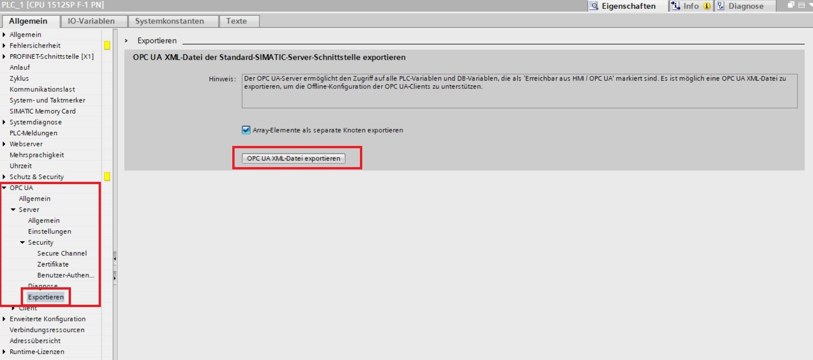
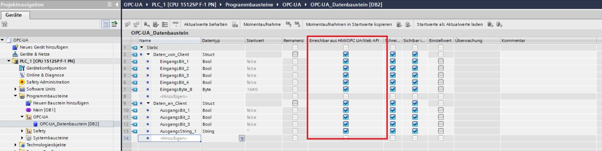

#Instructions for setting up OPC-UA server in TIA portal

The instructions were created using TIA Version V17 (Siemens) and an ET200SP CPU (Siemens).

1. Record or adjust the OPC-UA application name, which will be needed later for client configuration.

2. Activate the OPC-UA server in the server general settings and record the server address, which will be needed later for client configuration.

3. Add a server certificate or create a new one using the drop-down menu (3 dots).

4. If desired, disable "guest authentication" and activate "enable authentication via username and password." Then, a user and password must be set up, which must be stored in the client.

5. Enable the required runtime license for using the OPC-UA interface.

6. Once all variables that are read or written by the OPC-UA client have been created, it is still possible to output the data as an XML file using the "Export" function to import it on the client side.

7. All variables that are activated in the "Accessible from HMI/OPC-UA/WEB API" tab can be read and written by the client.
